<p align="center">
  
</p>

<p align="center">
  <a href="https://readme-typing-svg.demolab.com">
    
  </a>
</p>

<p align="center">
  
</p>

<div align="center">

[](https://github.com/kishwordulal1234/hexclaw)
[](LICENSE)
[](https://haxclaw.42web.io/?i=1)
[]()
[]()
[]()

</div>

<p align="center">
  
</p>

<br>

## ⬡ &nbsp; What is haxclaw?

**haxclaw** is a fully client-side, zero-dependency recon suite built for serious security researchers. It consolidates your entire reconnaissance workflow into a single, polished interface — Google dorking, subdomain enumeration, scope checking, findings management, and more.

```diff
+ No installs. No servers. No accounts. Just open and hunt.
+ All data stays 100% local in your browser.
- No cloud sync. No telemetry. No BS.
```

<br>

---

## ⬡ &nbsp; Features

<details>
<summary><b>🎯 &nbsp; Advanced Dork Engine</b> — click to expand</summary>
<br>

Fire precision-crafted Google Dorks directly from your browser across 8 categories:

| Category | What you find |
|:---|:---|
| `RECON` | Asset discovery & footprinting queries |
| `FILES` | Exposed documents, configs, and backups |
| `VULNERABILITIES` | Misconfigurations & CVE-related patterns |
| `CMS` | WordPress, Joomla, Drupal fingerprinting |
| `CLOUD` | AWS S3, Azure Blob, GCP exposed buckets |
| `API` | Exposed API keys, endpoints, swagger docs |
| `OSINT` | Emails, metadata, social exposure |
| `WEB ARCHIVE` | Historical snapshots & leaked pages |

- 🔥 **Bulk Launch** — fire an entire category with one click + built-in rate-limit delays
- 🔍 **Search & Filter** — find any dork instantly across hundreds of entries
- ⭐ **Favorites** — star your most-used dorks for lightning-fast access

<br>
</details>

<details>
<summary><b>📋 &nbsp; Bug Bounty Methodology Guide</b> — click to expand</summary>
<br>

Paste your target domain and haxclaw auto-generates copy-paste ready terminal commands for every recon phase:

```
[1] Subdomain Discovery   →  subfinder, amass, assetfinder
[2] DNS Resolution        →  massdns, dnsx
[3] Port Scanning         →  naabu, masscan
[4] HTTP Probing          →  httpx
[5] Vulnerability Scan    →  nuclei
[6] JS Analysis           →  gau, waybackurls, LinkFinder
[7] Parameter Fuzzing     →  ffuf, arjun
[8] Screenshot            →  gowitness, aquatone
```

<br>
</details>

<details>
<summary><b>🔧 &nbsp; Custom Dork Builder</b> — click to expand</summary>
<br>

Build your own dorks using intuitive operator dropdowns:

```
site:        inurl:       intitle:
filetype:    ext:         intext:
cache:       related:     before: / after:
```

Live preview → one-click test → save to personal library.

<br>
</details>

<details>
<summary><b>🛠️ &nbsp; Built-in Recon Toolkit</b> — click to expand</summary>
<br>

| Tool | What it does |
|:---|:---|
| **Scope Checker** | Paste wildcards, verify any URL is in-scope instantly |
| **Notes & Checklist** | Track findings without leaving the app |
| **Export System** | Dump your session to `TXT`, `MD`, `JSON`, or raw URLs |
| **Target Manager** | Save multiple targets, switch instantly |
| **Dork History** | Full history of every dork you've fired |

<br>
</details>

<details>
<summary><b>💻 &nbsp; Pro Workflows</b> — click to expand</summary>
<br>

- **Dark / Light Mode** — premium UI, your choice
- **Favorites System** — star your go-to dorks
- **Keyboard Shortcuts** — full power-user shortcut suite
- **Target Management** — multi-target workspace

<br>
</details>

---

<br>

## ⬡ &nbsp; Quick Start

> haxclaw is 100% client-side. No npm, no pip, no config.

```bash
# Clone
git clone https://github.com/kishwordulal1234/hexclaw.git

# Enter
cd hexclaw

# Open (pick your OS)
open dorker/index.html        # macOS
xdg-open dorker/index.html   # Linux
start dorker\index.html       # Windows
```

Or just hit the **[🌐 Live Demo](https://haxclaw.42web.io/?i=1)**

```diff
+ Works in any modern browser
+ Zero network requests — fully offline capable
+ All state saved in localStorage
```

<br>

---

## ⬡ &nbsp; Keyboard Shortcuts

<div align="center">

| Shortcut | Action |
|:---:|:---|
| <kbd>Ctrl</kbd> + <kbd>K</kbd> | Focus target input |
| <kbd>Ctrl</kbd> + <kbd>F</kbd> | Search dork database |
| <kbd>Ctrl</kbd> + <kbd>1</kbd> ... <kbd>0</kbd> | Switch tabs |
| <kbd>Ctrl</kbd> + <kbd>S</kbd> | Save current target |
| <kbd>Esc</kbd> | Close modals / cancel launch |
| <kbd>?</kbd> | Show shortcuts overlay |

</div>

<br>

---

## ⬡ &nbsp; Project Structure

```
hexclaw/
├── 📄 dorker.html                 # Root entry point
├── 📄 LICENSE
├── 📄 README.md
│
└── 📁 dorker/                     # Core application
    ├── 📄 index.html              # Main UI shell
    │
    ├── 📁 css/
    │   └── styles.css             # Premium styling + dark/light themes
    │
    ├── 📁 js/
    │   ├── app.js                 # Core logic & state
    │   ├── builder.js             # Custom dork builder
    │   ├── dork-engine.js         # Launch & rate-limiting
    │   ├── methodology.js         # Dynamic command generation
    │   ├── utils.js               # Shared helpers
    │   └── 📁 data/
    │       └── dorks.js           # Curated JSON dork library
    │
    └── 📁 pages/
        ├── exploits.html          # Exploit & PoC search
        └── methodology.html       # Full methodology reference
```

<br>

---

## ⬡ &nbsp; Stack

```diff
+ Frontend     →  HTML5 + Vanilla JS + CSS3
+ Storage      →  Browser localStorage (zero backend)
+ Theming      →  CSS custom properties (dark & light)
+ Deploy       →  Any static host — Netlify, GitHub Pages, etc.
- No backend. No database. No framework.
```

<br>

---

## ⬡ &nbsp; Roadmap

- [ ] 🦊 Firefox extension
- [ ] 🔐 Encrypted session import/export
- [ ] 🌐 Community dork submissions & voting
- [ ] 🔎 Integrated Shodan / Fofa / Censys tabs
- [ ] 📱 Mobile-first responsive redesign
- [ ] 🧩 Browser extension (Chrome/Firefox)

<br>

---

## ⬡ &nbsp; Contributing

```bash
# Fork → Clone → Branch → PR
git checkout -b feature/your-feature
git commit -m "feat: your change"
git push origin feature/your-feature
# Open a Pull Request ↗
```

Pull requests are welcome. For major changes, open an issue first.

<br>

---

## ⬡ &nbsp; Legal Disclaimer

```diff
- haxclaw is for AUTHORIZED security testing and educational use only.
- You must have EXPLICIT WRITTEN PERMISSION before testing any target.
- The author accepts NO liability for misuse or legal consequences.
+ Use responsibly. Stay legal. Happy hunting.
```

<br>

---

<p align="center">
  
</p>

<div align="center">

```
[ built with 🖤 for the bug bounty community ]
```

**[kishwordulal1234](https://github.com/kishwordulal1234)** &nbsp;·&nbsp; MIT License &nbsp;·&nbsp; 2025

<br>

[](https://github.com/kishwordulal1234/hexclaw)
[](https://github.com/kishwordulal1234)

</div>
