<p align="center">
  
</p>

<div align="center">

# ⬡ H A X C L A W

### `[ ADVANCED RECON ENGINE // BUG BOUNTY EDITION ]`

<br>

[](https://github.com/kishwordulal1234/hexclaw)
[](LICENSE)
[]()
[]()
[]()
[](https://lulublackhat.rf.gd/)

<br>

```
██╗  ██╗ █████╗ ██╗  ██╗ ██████╗██╗      █████╗ ██╗    ██╗
██║  ██║██╔══██╗╚██╗██╔╝██╔════╝██║     ██╔══██╗██║    ██║
███████║███████║ ╚███╔╝ ██║     ██║     ███████║██║ █╗ ██║
██╔══██║██╔══██║ ██╔██╗ ██║     ██║     ██╔══██║██║███╗██║
██║  ██║██║  ██║██╔╝ ██╗╚██████╗███████╗██║  ██║╚███╔███╔╝
╚═╝  ╚═╝╚═╝  ╚═╝╚═╝  ╚═╝ ╚═════╝╚══════╝╚═╝  ╚═╝ ╚══╝╚══╝
```

**The all-in-one reconnaissance command center for bug bounty hunters & pentesters.**

[🌐 Live Demo](https://lulublackhat.rf.gd/) · [🐛 Report Bug](https://github.com/kishwordulal1234/hexclaw/issues) · [⭐ Star this Repo](https://github.com/kishwordulal1234/hexclaw)

</div>

---

<br>

## 〢 What is haxclaw?

**haxclaw** is a fully client-side, zero-dependency recon suite built for serious security researchers. It consolidates your entire reconnaissance workflow into a single, polished interface — from Google dorking and subdomain enumeration to scope checking and findings management.

No installs. No servers. No BS. Just open and hack.

<br>

## 〢 Feature Breakdown

<br>

### 🎯 &nbsp; Advanced Dork Engine
> Fire precision-crafted Google Dorks directly from your browser.

| Category | Description |
|:---|:---|
| `RECON` | Asset discovery & footprinting queries |
| `FILES` | Exposed documents, configs, and backups |
| `VULNERABILITIES` | Common misconfigurations & CVE-related patterns |
| `CMS` | WordPress, Joomla, Drupal & more |
| `CLOUD` | AWS S3, Azure Blob, GCP exposed buckets |
| `API` | Exposed API keys, endpoints, and swagger docs |
| `OSINT` | People, emails, metadata & social exposure |
| `WEB ARCHIVE` | Historical snapshots & leaked pages |

- 🔥 **Bulk Launch** — Fire an entire category at once with built-in rate-limit delays
- 🔍 **Search & Filter** — Find any dork instantly across hundreds of entries
- ⭐ **Favorites** — Star your go-to dorks for rapid access

<br>

### 📋 &nbsp; Bug Bounty Methodology Guide
> From zero to shell — step by step.

Paste your target domain and haxclaw auto-generates copy-paste ready commands for every phase of recon:

```
Subdomain Discovery → Port Scanning → HTTP Probing → 
Vuln Scanning → JS Analysis → Parameter Fuzzing → ...
```

Built for tools like `subfinder`, `httpx`, `nuclei`, `ffuf`, `gau`, `waybackurls`, and more.

<br>

### 🔧 &nbsp; Custom Dork Builder
> Build your own dorks like a pro.

Intuitive dropdowns for every Google search operator — `site:`, `inurl:`, `intitle:`, `filetype:`, `ext:` — combined with a live preview and one-click save to your personal dork library.

<br>

### 🛠️ &nbsp; Built-in Recon Toolkit

| Tool | What it does |
|:---|:---|
| **Scope Checker** | Paste in-scope wildcards, verify any URL instantly |
| **Notes & Checklist** | Track findings and progress without leaving the app |
| **Export System** | Dump your session to `TXT`, `MD`, `JSON`, or raw URLs |
| **Target Manager** | Save multiple targets and switch between them on the fly |

<br>

## 〢 Quick Start

> haxclaw is 100% client-side. No npm, no pip, no config. Just clone and open.

```bash
# 1. Clone the repository
git clone https://github.com/kishwordulal1234/hexclaw.git

# 2. Enter the project directory
cd hexclaw

# 3. Open the app
open dorker/index.html   # macOS
xdg-open dorker/index.html  # Linux
start dorker\index.html  # Windows
```

Or just visit the **[Live Demo →](https://lulublackhat.rf.gd/)**

> 💡 All data (targets, history, notes, favorites) is stored locally in your browser via `localStorage`. Nothing leaves your machine.

<br>

## 〢 Keyboard Shortcuts

> Built for power users. Keep your hands on the keyboard.

| Shortcut | Action |
|:---:|:---|
| `Ctrl` + `K` | Focus target input field |
| `Ctrl` + `F` | Search dork database |
| `Ctrl` + `1` — `0` | Switch between tabs |
| `Ctrl` + `S` | Save current target |
| `Esc` | Close modals / cancel bulk launch |
| `?` | Show full shortcuts overlay |

<br>

## 〢 Project Structure

```
hexclaw/
├── 📄 dorker.html              # Entry point (root level shortcut)
├── 📄 LICENSE
├── 📄 README.md
│
└── 📁 dorker/                  # Core application
    ├── 📄 index.html           # Main UI shell
    │
    ├── 📁 css/
    │   └── styles.css          # Premium styling, CSS variables, dark/light themes
    │
    ├── 📁 js/
    │   ├── app.js              # Core logic & state management
    │   ├── builder.js          # Custom dork builder
    │   ├── dork-engine.js      # Dork launch & rate-limiting
    │   ├── methodology.js      # Dynamic command generation
    │   ├── utils.js            # Shared helper functions
    │   └── 📁 data/
    │       └── dorks.js        # Curated JSON dork library
    │
    └── 📁 pages/
        ├── exploits.html       # Exploit & PoC search
        └── methodology.html    # Full methodology reference
```

<br>

## 〢 Stack

```
Frontend   →   HTML5 + Vanilla JS + CSS3
Storage    →   Browser localStorage (zero backend)
Theming    →   CSS custom properties (dark & light)
Deploy     →   Any static host (Netlify, GitHub Pages, etc.)
```

<br>

## 〢 Roadmap

- [ ] Firefox extension support
- [ ] Import/export full sessions as encrypted JSON
- [ ] Community dork submissions & voting
- [ ] Integrated Shodan / Fofa / Censys search tabs
- [ ] Mobile-first responsive redesign

<br>

## 〢 Contributing

Pull requests are welcome. For major changes, open an issue first to discuss what you'd like to change.

```bash
# Fork → Clone → Branch → PR
git checkout -b feature/your-feature-name
```

<br>

## 〢 Legal Disclaimer

> ⚠️ **haxclaw is for authorized security testing and educational use only.**
>
> You are solely responsible for ensuring you have explicit written permission before testing any target. The author accepts no liability for misuse, unauthorized access, or any legal consequences arising from the use of this tool. Use responsibly. Stay legal.

<br>

---

<div align="center">

<br>

```
[ built with 🖤 for the bug bounty community ]
```

**[kishwordulal1234](https://github.com/kishwordulal1234)** · MIT License · 2025

<br>

[](https://github.com/kishwordulal1234/hexclaw)

</div>
